#  Cafe Management System (MERN Stack)

A full-stack Cafe Management System designed to handle internal café operations with three role-based dashboards: Admin, Kitchen, and User. The system focuses on smooth order flow, real-time updates, and efficient coordination between different roles.

---

## Project Overview

This system is built to manage café operations in a structured and automated way:

  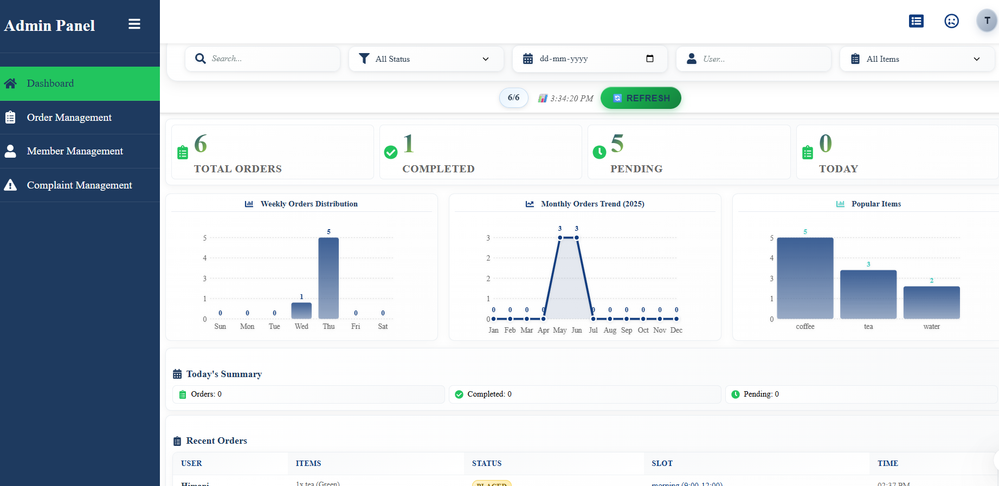
  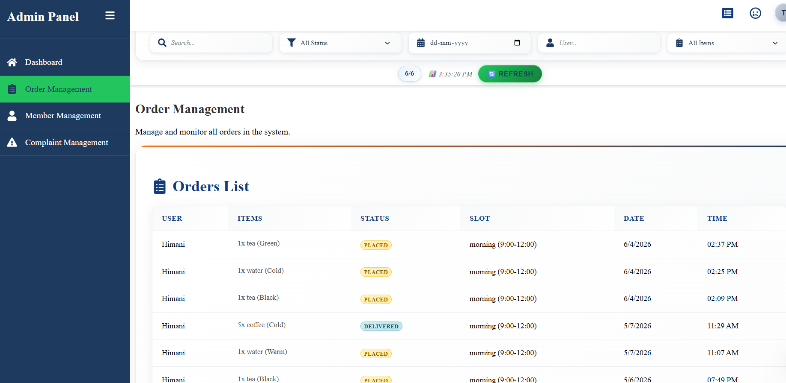
  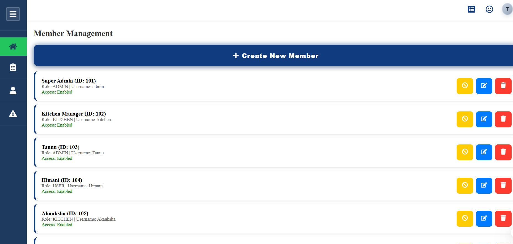

  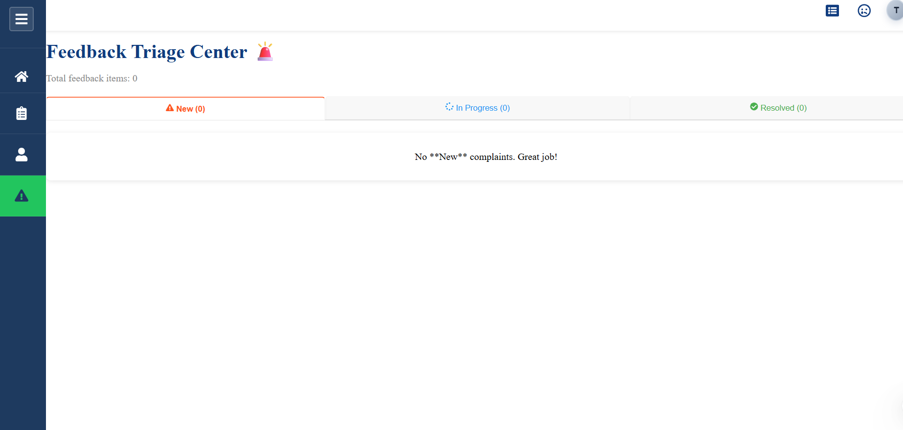

###  Admin Dashboard
- Create and manage user login credentials  
- Monitor all orders with detailed information  
- View analytics and performance charts  
- Track overall system activity  

---

###  User Dashboard

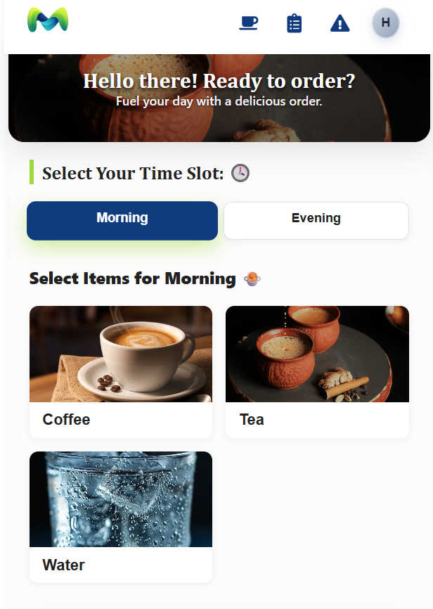
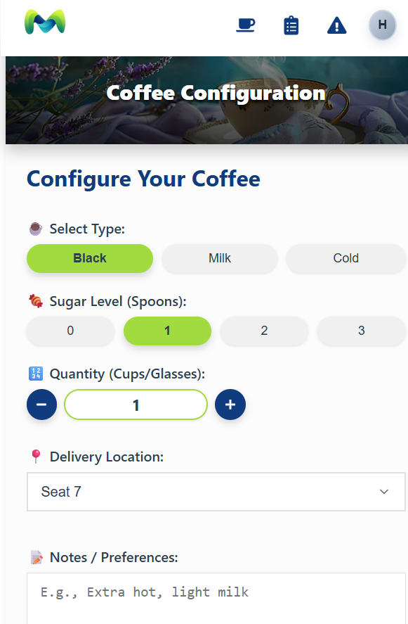
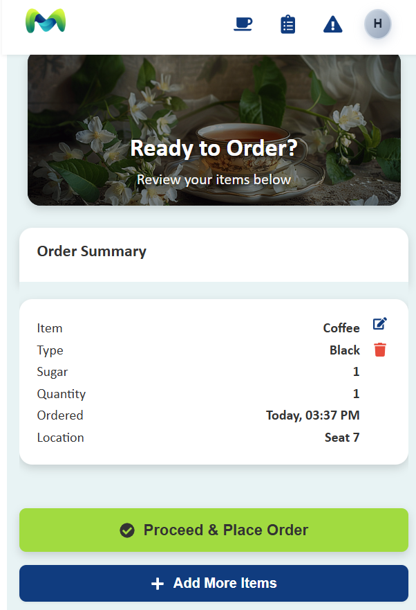
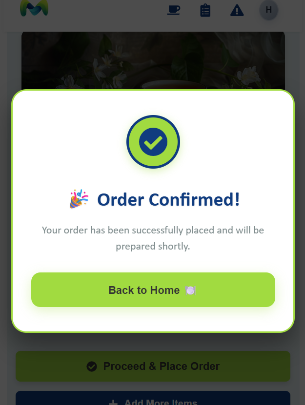
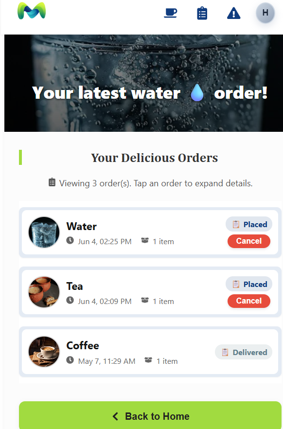
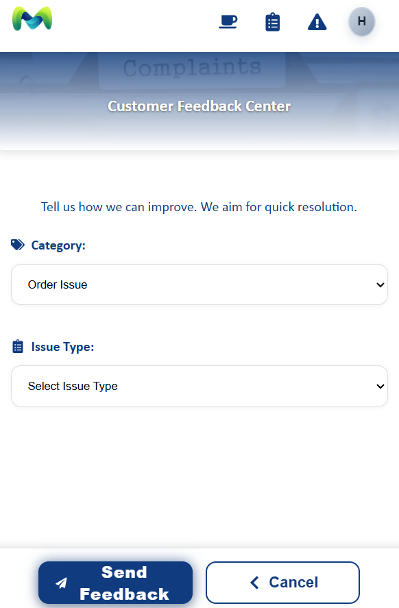

- Home page and configuration page  
- Place new orders easily  
- View order confirmation  
- Track order history  
- Request staff assistance using “Head Call” feature

---

###  Kitchen Dashboard

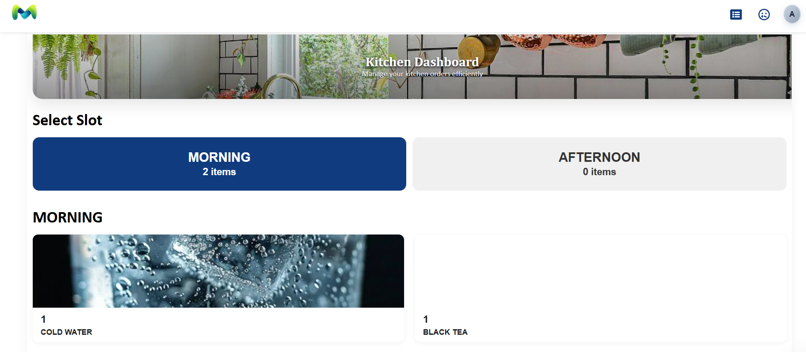
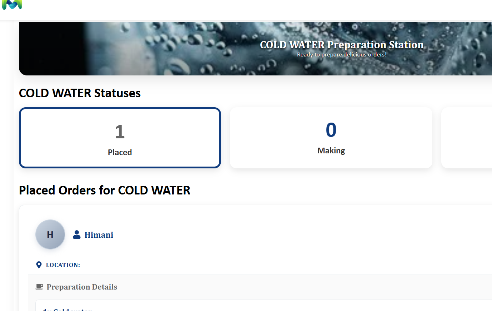
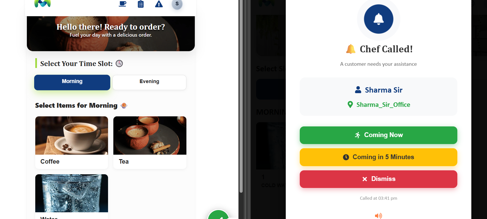

- View incoming orders in real-time  
- Update order status (Preparing, Completed, etc.)  
- Status updates reflect instantly across the system  
- Receive alerts for new orders  

---

##  Special Features
- Real-time order updates across all dashboards  
- Voice notification for kitchen when new order arrives  
- “Head Call” system to request staff assistance  
- Smooth internal workflow (no payment system, focus on operations)  

---

##  Tech Stack
- Frontend: React.js  
- Backend: Node.js, Express.js  
- Database: MongoDB  
- API: REST APIs  
- Real-time updates: (WebSockets / polling if used)

---

## 📁 Project Structure

frontend/ → User Interface (React)
backend/ → Server + APIs (Node.js + Express)

---

